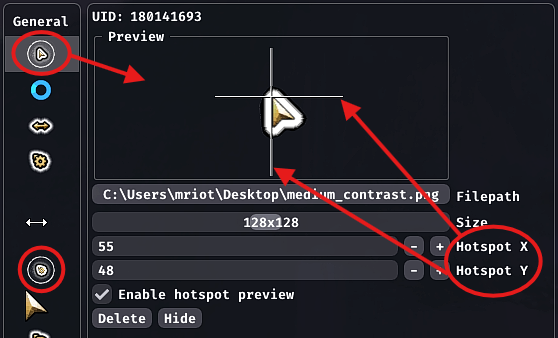

# Cmbat Cursor

A small quality-of-life [Nexus](https://github.com/RaidcoreGG/NEXUS) addon for [Guild Wars 2](https://www.guildwars2.com/) that helps you keep track of your mouse during combat.  

Upon entering combat, the cursor switches to the game’s high- or low-contrast version, depending on your choice, and returns to normal once combat ends.

## 📥 Installation

> [!NOTE]
> You can install the addon directly through the in-game Nexus library with a single click.

If you prefer a manual install:

1. Download the latest [`combat_cursor.dll`](https://github.com/mriot/combat-cursor-releases/releases/latest/download/combat_cursor.dll)
2. Put the file into your Guild Wars 2 Nexus addons folder (e.g., `C:/Program Files/Guild Wars 2/addons`)  
3. Enable the addon in-game in Nexus

## 🎨 Custom Cursors

While this addon does not directly support customization, it integrates very well with the [Custom Cursors](https://github.com/jordanrye/nexus-custom-cursors) addon.  
You can use it to replace the `high-contrast` cursor with any texture you choose, as shown below:

> Make sure to adjust the cursor’s hotspot accordingly.

## ⚠️ Disclaimer

### USE AT YOUR OWN RISK

The addon is provided as-is. It’s meant to be helpful, but the author can’t take responsibility for problems that may occur.  
Using third-party addons in Guild Wars 2 is always at your own discretion.

## 🔒 Source Code

The source code is not public. This repository is only used for releases.  
Memory reading and related logic are kept private to stay in line with ArenaNet’s general guidelines for addon development.

## 🧰 Dependencies

- [Nexus](https://raidcore.gg/Nexus)
- [ImGui](https://github.com/ocornut/imgui)
- [inifile-cpp](https://github.com/Rookfighter/inifile-cpp)

## 🙏 Acknowledgments

- Thanks to the Nexus community (especially Delta)
- Thanks to Bird for testing

---

This addon is not affiliated with nor endorsed by ArenaNet or NCSOFT.
