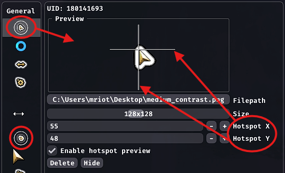

# Cmbat Cursor

A small quality-of-life [Nexus](https://github.com/RaidcoreGG/NEXUS) addon for [Guild Wars 2](https://www.guildwars2.com/) that helps you keep track of your mouse during combat.  

Upon entering combat, the cursor switches to the game’s high- or low-contrast version, depending on your choice, and returns to normal once combat ends.

Additionally, the cursor can temporarily revert to normal when the mouse enters the inventory, minimap or any addon UI during combat.

## Installation

> [!NOTE]
> You can install the addon directly through the in-game Nexus library with a single click.

If you prefer a manual install:

1. Download the latest [`combat_cursor.dll`](https://github.com/mriot/combat-cursor-releases/releases/latest/download/combat_cursor.dll)
2. Put the file into your Guild Wars 2 Nexus addons folder (e.g., `C:/Program Files/Guild Wars 2/addons`)  
3. Enable the addon in-game in Nexus
4. Click the configure button to configure the addon to your liking

## Custom Cursors

While this addon does not directly support customization, it integrates very well with the [Custom Cursors](https://github.com/jordanrye/nexus-custom-cursors) addon.  
You can use it to replace the in-combat cursor with any texture you choose, as shown below:

> Make sure to adjust the cursor’s hotspot accordingly.

## Source Code

The source code is kept private to comply with ArenaNet’s guidelines for addons that interact with the game’s memory.  
Code review may be requested by ArenaNet at any time.

## Dependencies

- [Nexus](https://raidcore.gg/Nexus)
- [ImGui](https://github.com/ocornut/imgui)
- [inifile-cpp](https://github.com/Rookfighter/inifile-cpp)

Special thanks to Delta and Gera for their support and Bird for testing.

## Disclaimer

### ⚠️ USE AT YOUR OWN RISK ⚠️

The addon is provided as-is. It’s meant to be helpful, but I can’t take responsibility for problems that may occur.  
Using third-party addons in Guild Wars 2 is always at your own discretion.

---

This addon is not affiliated with nor endorsed by ArenaNet or NCSOFT.
